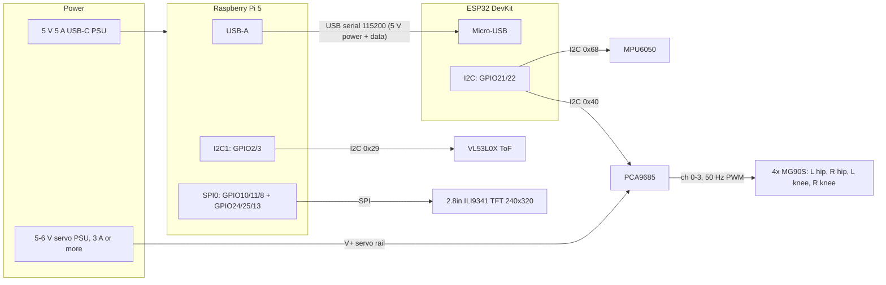

# EMO-Bot: Personal Desk Robot

EMO-Bot is a small two-legged desk companion. It stands and keeps its torso level with an
IMU-driven balance controller, walks on command, reminds you when you slouch, and holds a
spoken conversation after a wake word.

A **Raspberry Pi 5** does the thinking (vision, speech, decisions). An **ESP32** does the
fast, safety-critical control (balance PID, walking gait, fall detection) and drives four servos
through a PCA9685.

- **Step-by-step setup, running and tuning guide:** [RUNNING.md](RUNNING.md)
- **No hardware yet?** `python tools/sim_nano.py` runs the real firmware against a simulated robot.

---

## What it does

| Feature | How |
| --- | --- |
| Stands and stays level | MPU6050 → complementary filter → PID on torso pitch → both hip servos (100 Hz on the ESP32) |
| Walks and turns | Sinusoidal gait on hips and knees; turning uses different stride lengths per leg |
| Stays safe | Servos switch off if it falls past 45°, it stops walking if the Pi goes quiet, walks are time-limited, latched E-stop |
| Posture reminders | Camera + MediaPipe pose; after 3 s of slouching it does a knee bob and says a reminder |
| Conversation | "Porcupine" wake word → Whisper → GPT → ElevenLabs; the robot stands still while talking |
| Remote control | Everything is driven over MQTT (`robot/locomotion/cmd`, `robot/error`, ...) |

With hips and knees only (no ankle or sideways hip joints), the legs move forward and back only.
The feet are flat and rigid, so the robot stands on its own. The balance loop keeps the **torso**
level against slopes, pushes and the rocking of the gait. It can't lean sideways, so it relies on
wide, flat feet and walks with a short shuffle.

## How it fits together

```
 Raspberry Pi 5 (Python, main.py)                                ESP32 (firmware, 100 Hz)
 ┌─────────────────────────────────────────────┐                ┌─────────────────────────────────┐
 │ vision ──┐                                  │  S / W / G /   │ MPU6050 → pitch filter          │
 │ wake word├─► MQTT ─► behavior tree ─► serial├─ E / R ... ───►│ PID → hip correction            │
 │ speech ◄─┘  (Mosquitto)   (10 Hz)           │◄─ ACK / EVT / T│ gait + slew limit → PCA9685     │
 └─────────────────────────────────────────────┘                │ fall detection, walk watchdog   │
                                                                └──────────────┬──────────────────┘
                                                                  4 servos: L/R hip, L/R knee
```

The Pi decides *what* to do (stand, walk for 3 s, gesture). The ESP32 decides *how* every 10 ms and
keeps the robot safe even if the Pi stalls.

---

## Files

### Robot software (Raspberry Pi)

| File | What it is |
| --- | --- |
| `main.py` | **Entry point.** Starts every task in one asyncio process and supervises them. If a critical task (serial, behavior tree) crashes, the robot shuts down. If an optional one (vision, wake word, speech) crashes, it is logged and the robot keeps running. Routes the controller's events to MQTT and turns behavior-tree cues into speech. |
| `config.py` | **All settings in one place.** Loads `.env` first, then exposes every setting (serial port, camera, audio devices, API keys, timeouts, feature switches, MQTT login/TLS) and every MQTT topic name. |
| `mqtt_client.py` | **Shared MQTT connection.** Every module connects through it, so they all use the same broker login and TLS settings, and callbacks are attached before connecting. Also defines the 256-byte payload limit. |
| `behavior_tree_module.py` | **The robot's decision-making.** A 10 Hz py_trees priority tree: E-stop > IMU fault > fallen > rest > conversation > posture reminder > walk > stand. Turns MQTT commands (`walk,70,0,3`, `stand`, ...) into controller commands, only counts the robot as standing once the controller confirms it (`ACK,S`), and re-sends walk commands as a heartbeat. Runs standalone for testing: `python behavior_tree_module.py`. |
| `serial_module.py` | **Link to the ESP32 (or Nano).** Opens the serial port (or `socket://` for the simulator), waits for the `READY` banner, sends one command at a time and matches each ACK/NACK to its command, gives the E-stop priority, forwards events (`EVT,FALLEN`) and telemetry, detects controller resets, parks the servos on shutdown and reconnects forever. `SERIAL_PORT=sim` only logs commands. |
| `vision_posture_module.py` | **Camera vision.** MediaPipe pose estimation decides good or poor posture relative to your own upright baseline and publishes `POSTURE_POOR` / `POSTURE_OK`. Reopens the camera if it drops out and publishes `robot/vision/state` `UP`/`DOWN`. Face detection is optional (`FACE_DETECTION=1`). Supports the Pi CSI camera (Picamera2), USB cameras and laptop webcams. Runs standalone. |
| `audio_trigger_task.py` | **Wake word.** Porcupine listens for the wake word, then records 5 s of speech and hands it to the speech pipeline. Ignores its own voice while replying. Runs standalone to test the microphone. |
| `api_routing_task.py` | **Speech pipeline.** Whisper (speech → text) → GPT (reply) → ElevenLabs (text → speech) → speaker. Also speaks the robot's cues ("I fell over"). Plays a fallback beep on any failure. `python api_routing_task.py "Hello"` checks keys and speaker. |

### Microcontroller firmware

| File | What it is |
| --- | --- |
| `firmware/emo_esp32/emo_esp32.ino` | **ESP32 firmware (default).** Port of the Nano sketch below: same protocol and control code. ESP32 specifics: I2C on GPIO21/22, settings in flash-emulated EEPROM (`EEPROM.commit()`), I2C timeout via `Wire.setTimeOut()`, and a `LINK_UART2` switch for USB (`Serial`) or the Pi's GPIO UART (`Serial2`, GPIO16/17, 3.3 V, no level shifter). |
| `firmware/emo_nano/emo_nano.ino` | **Arduino Nano firmware (alternative).** 100 Hz control loop: MPU6050 IMU with a complementary filter, PID on torso pitch through the hips (anti-windup, filtered D term), walking gait with knee lift and smooth start/stop, per-joint speed and angle limits, fall detection, walk watchdog, and calibration and PID gains saved in EEPROM. Speaks a line-based serial protocol (`S` stand, `W,<speed>,<turn>` walk, `G,1` gesture, `E`/`R` E-stop, `C` calibrate, `K` gains, `T` telemetry, `J` raw servo moves for setup). The configuration you adjust for your build (servo trims and directions, stance, gait sizes) is at the top. |

### Tools, assets and deployment

| File | What it is |
| --- | --- |
| `tools/sim_nano.py` | **Simulated controller.** Compiles the real firmware (ESP32 by default, `--firmware nano` for the Nano) for your PC, runs it against a simulated robot (laggy servos, noisy IMU) and serves it as a serial port on `socket://127.0.0.1:7777`. Type `tilt 8` or `tilt 70 200` to put it on a slope or knock it over. Needs `g++`. |
| `assets/network_error.wav` | Three descending beeps, played when the cloud speech pipeline fails. |
| `deploy/emo-bot.service` | systemd unit that starts the robot on boot and restarts it if it crashes (install steps in RUNNING.md section 10). |

### Configuration

| File | What it is |
| --- | --- |
| `.env.example` | Template for your `.env` (API keys, serial port, camera, audio devices, feature switches such as `FACE_DETECTION` and `ALLOW_NO_IMU`). Copy it to `.env`; `.env` is never committed. |
| `requirements.txt` | Python packages for the robot (pins `mediapipe==0.10.18`, the newest release that has both the API used here and Raspberry Pi wheels). |
| `requirements-dev.txt` | Packages to run the tests and linter on any computer (any Python 3.9+), without robot hardware. |
| `pyproject.toml` | Settings for the `ruff` linter and `pytest`. |
| `.gitignore` | Keeps `.env`, virtual environments, caches, build output and local Claude workspace files (`.claude/`, `CLAUDE.md`, `docs/`) out of git. |

### Documentation

| File | What it is |
| --- | --- |
| `README.md` | This overview. |
| `Issues.md` | Code review of the Raspberry Pi side (by Pratik): 13 issues ranked by severity, each with how it was fixed. |
| `RUNNING.md` | The full guide: laptop dry run, tests, flashing the controller (ESP32 or Nano), first power-up of the legs, Pi setup, `.env` reference, checking each subsystem, running, starting on boot, PID/gait tuning, troubleshooting. |

### Tests (no hardware needed)

| File | What it tests |
| --- | --- |
| `tests/test_firmware.py` | Compiles both firmwares (ESP32, Nano) for your PC and runs 11 scenarios on each against a simulated robot: serial protocol, IMU direction, recovery from a slope, walking, watchdog, fall detection, wrong-sensor-direction safety, calibration + EEPROM, missing IMU, IMU failing while walking (and recovering), telemetry. Skipped if `g++` isn't installed. |
| `tests/firmware/harness.cpp` | The simulator behind those scenarios (and behind `tools/sim_nano.py`): a planar model of the robot, simulated MPU6050, and a `serve` mode. |
| `tests/firmware/Arduino.h`, `Wire.h`, `EEPROM.h`, `Adafruit_PWMServoDriver.h` | Small stand-ins for the Arduino libraries so the firmware compiles on a PC. |
| `tests/test_behavior_tree.py` | Standing, walking and its heartbeat, stop, E-stop, falls, rest, calibration, tuning commands, priorities. |
| `tests/test_serial.py` | Reply parsing, `READY` banner, event/telemetry forwarding, queueing, sim mode. |
| `tests/test_vision.py` | Face selection, posture rules at any distance, personal baseline, alert timing. |
| `tests/test_api_routing.py` | The speech pipeline against a mocked HTTP server: WAV output, timeouts, missing keys, fallback, phrase cache. |
| `tests/test_main.py` | The whole runtime starts without hardware and stands the legs up. |
| `tests/test_round2_misc.py` | Round-2 review checks that span modules: MQTT login/TLS, every module using the shared MQTT client, speech cues never evicting a recording, the simulator's private build directory. |
| `tests/conftest.py` | pytest setup that makes the modules importable. |

---

## Quick start

**On a laptop, no hardware** (details in [RUNNING.md section 2](RUNNING.md#2-quick-start-on-a-laptop-no-hardware)):

```bash
git clone https://github.com/coderForLife-A1/EMO-Bot.git && cd EMO-Bot
python -m venv .venv && source .venv/bin/activate      # Windows: .venv\Scripts\activate
pip install -r requirements.txt
cp .env.example .env    # set SERIAL_PORT=socket://127.0.0.1:7777, ENABLE_AUDIO=0, ENABLE_VISION=0
python tools/sim_nano.py          # terminal 1 (needs g++ and a running Mosquitto broker)
python main.py                    # terminal 2
mosquitto_pub -t robot/locomotion/cmd -m walk,70,0,3   # terminal 3
```

**On the robot** (Raspberry Pi OS Bookworm 64-bit, Python 3.11):

```bash
sudo apt install -y git mosquitto mosquitto-clients python3-venv python3-picamera2 portaudio19-dev alsa-utils
git clone https://github.com/coderForLife-A1/EMO-Bot.git ~/EMO-Bot && cd ~/EMO-Bot
python3 -m venv --system-site-packages .venv && source .venv/bin/activate
pip install -r requirements.txt
cp .env.example .env            # add API keys; set SERIAL_PORT / CAMERA_SOURCE / audio devices
arduino-cli compile --fqbn esp32:esp32:esp32 firmware/emo_esp32
arduino-cli upload  --fqbn esp32:esp32:esp32 -p /dev/ttyUSB0 firmware/emo_esp32   # board setup: RUNNING.md section 4
python main.py
```

Before the first real run, do [RUNNING.md section 5](RUNNING.md#5-first-power-up-of-the-legs)
with the robot held in the air: servo trims and directions, IMU direction, level calibration.

**Run the tests:** `pip install -r requirements-dev.txt && ruff check . && pytest`

### Controlling the robot

```bash
mosquitto_pub -t robot/locomotion/cmd -m stand             # stand and balance
mosquitto_pub -t robot/locomotion/cmd -m walk,70,0,3       # walk forward 3 s (speed, turn: -100..100)
mosquitto_pub -t robot/locomotion/cmd -m walk,0,80,2       # turn right in place
mosquitto_pub -t robot/locomotion/cmd -m rest              # servos off until "stand"
mosquitto_pub -t robot/locomotion/cmd -m gains,0.8,3,0.03  # tune the balance PID live (saved on the ESP32)
mosquitto_pub -t robot/locomotion/cmd -m telemetry,1       # stream pitch / correction on robot/locomotion/telemetry
mosquitto_pub -t robot/error -m error                      # E-stop; "clear" releases it
mosquitto_sub -t 'robot/#' -v                              # watch everything
```

All topics and the controller's serial protocol are listed in [RUNNING.md section 1](RUNNING.md#1-how-the-pieces-fit-together).

---

## Hardware

| Component | Function | Interface / electrical requirement |
| --- | --- | --- |
| Raspberry Pi 5 | Runs vision, speech, MQTT and the behavior tree | 5 V USB-C power; 3.3 V GPIO; Linux ALSA/V4L2 |
| ESP32 DevKit (ESP32-WROOM-32) | Balance and gait controller | USB/UART at 115200 baud; 3.3 V logic |
| Arduino Nano *(alternative)* | Balance and gait controller | USB/UART at 115200 baud; 5 V logic on typical Nano boards |
| PCA9685 | 16-channel, 12-bit PWM servo driver | I2C address `0x40` on the controller's I2C bus (ESP32 GPIO21/22, Nano A4/A5); separate servo supply |
| MPU6050 | 6-axis IMU for torso pitch (balance, fall detection) | I2C address `0x68` on the same I2C bus, shared with the PCA9685; flat on the pelvis, X arrow forward |
| 4x MG90S servos (2 hip, 2 knee) | Legs | PCA9685 channels 0-3; 5-6 V servo supply (3 A or more), never the Pi or controller rail |
| ReSpeaker HAT | Microphone input | ALSA card 0; check with `arecord -l` and `python -m sounddevice` |
| CSI/USB camera | Posture sensing | `CAMERA_SOURCE=picamera2` (Pi 5 CSI) or a V4L2 device such as `/dev/video0` |
| Speaker + amplifier | Speech output | ALSA playback, e.g. `plughw:0` |
| VL53L0X *(wired, no driver code yet)* | Time-of-flight distance sensor | Pi I2C1 (pins 3/5), address `0x29`; 3.3 V |
| 2.8" SPI TFT, 240x320, no touch (ILI9341) *(wired, no driver code yet)* | Face display | Pi SPI0 + DC, RESET, backlight GPIOs; 3.3 V logic |

## Wiring & Pinouts

All grounds must be common. Confirm your exact breakout pin labels before powering up: clone modules
vary. Pin numbers below are **physical header pins** on the Pi and **GPIO numbers** on the ESP32.

### System overview



### Raspberry Pi 5 header

`*` = used. ToF = VL53L0X. `(opt)` = GPIO UART link or optional sensor pins only.

```text
          ToF VIN *    3V3 ( 1) ( 2) 5V
          ToF SDA *  GPIO2 ( 3) ( 4) 5V
          ToF SCL *  GPIO3 ( 5) ( 6) GND    * ESP32 GND (opt, UART)
                     GPIO4 ( 7) ( 8) GPIO14 * ESP32 GPIO16 (opt, UART)
          ToF GND *    GND ( 9) (10) GPIO15 * ESP32 GPIO17 (opt, UART)
                    GPIO17 (11) (12) GPIO18
                    GPIO27 (13) (14) GND
  ToF GPIO1 (opt) * GPIO22 (15) (16) GPIO23 * ToF XSHUT (opt)
          TFT VCC *    3V3 (17) (18) GPIO24 * TFT RESET
     TFT SDI/MOSI * GPIO10 (19) (20) GND    * TFT GND
                     GPIO9 (21) (22) GPIO25 * TFT DC/RS
          TFT SCK * GPIO11 (23) (24) GPIO8  * TFT CS
                       GND (25) (26) GPIO7
                     ID_SD (27) (28) ID_SC
                     GPIO5 (29) (30) GND
                     GPIO6 (31) (32) GPIO12
          TFT LED * GPIO13 (33) (34) GND
                    GPIO19 (35) (36) GPIO16
                    GPIO26 (37) (38) GPIO20
                       GND (39) (40) GPIO21
```

- Enable the buses: `sudo raspi-config` -> Interface Options -> I2C **on**, SPI **on**.
  For the GPIO UART link also Serial Port -> login shell **off**, hardware **on**.
- GPIO18-21 (pins 12, 35, 38, 40) are left free for an I2S microphone HAT.
- ReSpeaker 2-Mics HAT: its APA102 LEDs sit on SPI0 MOSI/SCLK with no chip-select, so TFT traffic
  also clocks the LEDs. Either ignore the LED flicker or move the TFT to SPI1 (then it clashes with I2S).

### ESP32 DevKit (ESP32-WROOM-32)

| ESP32 pin | Connects to | Notes |
| --- | --- | --- |
| Micro-USB | Pi 5 USB-A | Power (5 V) and serial link, `/dev/ttyUSB0` on the Pi |
| GPIO21 (SDA) | MPU6050 `SDA`, PCA9685 `SDA` | Shared I2C bus, 400 kHz |
| GPIO22 (SCL) | MPU6050 `SCL`, PCA9685 `SCL` | Shared I2C bus |
| 3V3 | MPU6050 `VCC`, PCA9685 `VCC` | Logic power only; the bus runs at 3.3 V |
| GND | MPU6050 `GND`, PCA9685 `GND`, servo PSU `-` | Common ground |
| GPIO16 (RX2) *(opt)* | Pi pin 8 (GPIO14/TXD) | Only with `#define LINK_UART2 1` |
| GPIO17 (TX2) *(opt)* | Pi pin 10 (GPIO15/RXD) | Only with `#define LINK_UART2 1` |
| VIN (5 V) *(opt)* | Separate 5 V supply | Only if not powered over USB; **never** the servo rail (brown-out resets) |

### PCA9685 + 4x MG90S servos

| PCA9685 pin | Connects to | Notes |
| --- | --- | --- |
| `VCC` | ESP32 3V3 | Chip logic |
| `GND` | ESP32 GND | |
| `SDA` / `SCL` | ESP32 GPIO21 / GPIO22 | Address `0x40` (all A0-A5 jumpers open) |
| `OE` | Leave open | Pulled low on the board: outputs enabled |
| `V+` (screw terminal) | Servo PSU `+` (5-6 V) | Add a 1000 µF capacitor across `V+`/`GND` |
| `GND` (screw terminal) | Servo PSU `-` | Tied to the ESP32 ground |
| Channel 0 | Left hip MG90S | |
| Channel 1 | Right hip MG90S | Mirrored: `LEG_DIR` = -1 |
| Channel 2 | Left knee MG90S | |
| Channel 3 | Right knee MG90S | Mirrored: `LEG_DIR` = -1 |

MG90S lead colours on each 3-pin PCA9685 header: **brown** = `GND`, **red** = `V+` (4.8-6 V), **orange** = PWM signal.
Size the servo PSU for stall current: about 0.7 A per MG90S, so 3 A or more for four.

### MPU6050 (GY-521 breakout)

| MPU6050 pin | Connects to | Notes |
| --- | --- | --- |
| `VCC` | ESP32 3V3 | GY-521 has an on-board regulator; 3.3 V in is fine |
| `GND` | ESP32 GND | |
| `SCL` | ESP32 GPIO22 | Shared with the PCA9685 |
| `SDA` | ESP32 GPIO21 | Shared with the PCA9685 |
| `AD0` | GND | Address `0x68` |
| `XDA`, `XCL`, `INT` | Not connected | |

Mount flat on the pelvis with the X arrow pointing forward, away from servo vibration where possible.

### 2.8" SPI TFT, 240x320, no touch (ILI9341) *(no driver code yet)*

| TFT pin | Pi 5 pin | Notes |
| --- | --- | --- |
| `VCC` | 17 (3V3) | Most modules also accept 5 V via an on-board regulator; logic is 3.3 V only |
| `GND` | 20 (GND) | |
| `CS` | 24 (GPIO8, SPI0 CE0) | |
| `RESET` | 18 (GPIO24) | |
| `DC` / `RS` | 22 (GPIO25) | |
| `SDI` (MOSI) | 19 (GPIO10, SPI0 MOSI) | |
| `SCK` | 23 (GPIO11, SPI0 SCLK) | |
| `LED` | 33 (GPIO13, PWM) | Backlight; modules with an on-board transistor only. Otherwise tie to 3V3 |
| `SDO` (MISO) | Not connected | Write-only use; pin 21 (GPIO9) if reading back |

Never drive the TFT logic pins at 5 V.

### VL53L0X time-of-flight sensor *(no driver code yet)*

| VL53L0X pin | Pi 5 pin | Notes |
| --- | --- | --- |
| `VIN` | 1 (3V3) | |
| `GND` | 9 (GND) | |
| `SDA` | 3 (GPIO2, I2C1 SDA) | Address `0x29`; the Pi board has 1.8 kΩ pull-ups |
| `SCL` | 5 (GPIO3, I2C1 SCL) | |
| `XSHUT` *(opt)* | 16 (GPIO23) | Hardware reset / sleep; leave open if unused (pulled up on the breakout) |
| `GPIO1` *(opt)* | 15 (GPIO22) | Data-ready interrupt; leave open if polling |

Check with `i2cdetect -y 1` -> `29`. The PCA9685 and MPU6050 are on the ESP32's bus, not these Pi pins.

### Pi-to-controller link

The simplest option is a USB cable (`SERIAL_PORT=/dev/ttyUSB0`). To use the Pi's GPIO UART instead
(`SERIAL_PORT=/dev/serial0`):

**ESP32** (set `#define LINK_UART2 1` in `firmware/emo_esp32/emo_esp32.ino`; both sides 3.3 V, no level shifter):

- Pi physical pin 8, GPIO14/TXD -> ESP32 GPIO16 (RX2).
- ESP32 GPIO17 (TX2) -> Pi physical pin 10, GPIO15/RXD.
- Pi physical pin 6 (`GND`) -> ESP32 `GND`.
- The sketch passes GPIO16/17 to `Serial2.begin()` explicitly: arduino-esp32 core 3.x defaults `Serial2` to GPIO4/25.
- ESP32-WROVER modules use GPIO16/17 for PSRAM: change `LINK_RX_PIN` / `LINK_TX_PIN` there.

**Nano:**

- Pi physical pin 8, GPIO14/TXD -> Nano `RX` through a bidirectional level shifter or a verified 3.3 V-safe input.
- Nano `TX` -> Pi physical pin 10, GPIO15/RXD through a 5 V-to-3.3 V level shifter. Never connect a typical 5 V Nano TX directly to Pi GPIO15.
- Pi physical pin 6 (`GND`) -> Nano `GND`.
- 115200 baud, one ASCII command per line (protocol in [RUNNING.md](RUNNING.md#controller-serial-protocol-115200-baud-one-command-per-line)).

### Arduino Nano / PCA9685 / MPU6050 (alternative)

- Nano A4/SDA -> PCA9685 `SDA` and MPU6050 `SDA` (shared bus).
- Nano A5/SCL -> PCA9685 `SCL` and MPU6050 `SCL`.
- Nano `5V` or the PCA9685 logic supply -> PCA9685 `VCC`, according to the board's logic-voltage specification.
- Nano `5V` -> MPU6050 `VCC` (GY-521 breakouts have an on-board 3.3 V regulator); MPU6050 `AD0` to `GND` for address `0x68`.
- Nano `GND` -> PCA9685 `GND` and MPU6050 `GND`.
- External regulated servo supply -> PCA9685 `V+` and servo power ground. Add a 1000 µF capacitor at the PCA9685.
- Leg servos: left hip -> channel 0, right hip -> 1, left knee -> 2, right knee -> 3. PWM is 50 Hz.
- Mount the MPU6050 flat on the pelvis with its X arrow pointing forward, away from servo vibration where possible.

---

## Safety

- **Keep the MQTT broker private.** Anyone who can publish to it can drive the robot. By default everything
  runs on `127.0.0.1`. For control from another machine, use a broker login, ACLs and TLS
  (`MQTT_USERNAME`, `MQTT_PASSWORD`, `MQTT_TLS`; see [RUNNING.md section 13](RUNNING.md#13-secure-mqtt)).
- **Bad input is rejected.** Oversized payloads (over 256 bytes) are dropped unread, a flood of tuning commands
  can't crowd out the E-stop, and gains/calibration are limited to one per second to spare the controller's flash.

- `mosquitto_pub -t robot/error -m error` latches an E-stop: the controller turns every servo output off
  and refuses commands until `mosquitto_pub -t robot/error -m clear`. The E-stop skips ahead of any
  commands already queued, and a malformed MQTT message can't disable it.
- If the IMU stops answering, there is no balance and no fall detection, so the controller stops walking
  and the Pi relaxes the servos until the IMU answers again (`EVT,IMU_FAIL`).
- When the Pi software exits, it stops any walk and switches the servos off first.
- If the robot tips past 45° for a quarter of a second, the controller switches every servo off
  (`EVT,FALLEN`), the robot asks to be stood back up, and it won't stand again until it is upright and told `stand`.
- The controller stops walking if the Pi hasn't re-sent the walk command for 1 s. A single walk command
  never lasts longer than 10 s, so the robot doesn't wander off the desk.
- Joint limits are enforced in the firmware. Set them for your mechanics before running the full
  robot, with the robot held in the air (RUNNING.md section 5).

## Troubleshooting

The most common problems:

| Symptom | Fix |
| --- | --- |
| Servos jitter, or the Pi reboots when they move | Separate regulated servo supply sized for stall current, 1000 µF at the PCA9685, common ground |
| Banner says `READY,NOIMU` | Check the MPU6050 wiring on A4/A5 and that `AD0` is low. The robot still stands and walks, without balance |
| Torso tilts further instead of correcting | Servo direction or IMU direction is wrong: RUNNING.md section 5, steps 3 and 5 |
| Buzzing while standing | Balance gains too high or loose servo horns: RUNNING.md section 11 |
| Robot falls sideways when walking | Lower `KNEE_LIFT_DEG`, widen the feet, slow the gait |
| API errors or timeouts | `python api_routing_task.py "test"` shows the exact error; check `.env` |

Full table: [RUNNING.md section 12](RUNNING.md#12-troubleshooting).
